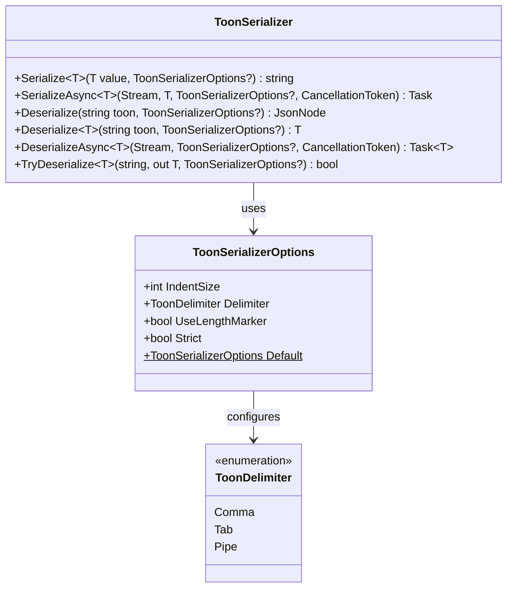

# ToonSharp Demo

[](https://dotnet.microsoft.com/)
[](https://www.nuget.org/packages/ToonSharp)
[](LICENSE)

A .NET console application that demonstrates the [**ToonSharp**](https://www.nuget.org/packages/ToonSharp) serialization library -- including serialization, deserialization, streaming, custom options, and a head-to-head benchmark against `System.Text.Json`.

> **Looking for the full article?** See [`ARTICLE.md`](ARTICLE.md) for an in-depth write-up suitable for Medium / blog publishing.

---

## What Is Toon?

Toon is a human-readable, key-value serialization format. It strips out JSON's syntactic overhead -- braces, brackets, key quoting -- and replaces it with indentation-based nesting and inline arrays:

```
Name: Alice Johnson
Age: 29
Address:
  Street: 742 Evergreen Terrace
  City: Springfield
Hobbies[3]: Reading,Hiking,Photography
```

Compare to JSON (16 lines with braces, brackets, and quotes everywhere) -- Toon achieves the same in **10 lines**.

---

## Project Structure

```
Toon/
|-- Toon.csproj            # Console app targeting .NET 10
|-- Program.cs             # Demo: serialize, deserialize, benchmark
+-- WeatherForecast.cs     # Model classes (WeatherForecast, UserProfile, Address)
README.md                  # <-- You are here
ARTICLE.md                 # Full article (Medium-ready)
```

---

## Prerequisites

- [.NET 10 SDK](https://dotnet.microsoft.com/download/dotnet/10.0) or later

---

## Quick Start

```bash
git clone <repo-url>
cd Toon
dotnet run
```

---

## What the Demo Covers

| # | Section | What It Shows |
|---|---------|---------------|
| 1 | Basic serialization | `ToonSerializer.Serialize<T>()` on a flat object |
| 2 | Deserialization | `ToonSerializer.Deserialize<T>()` back to a typed object |
| 3 | Nested objects | Indentation-based nesting + inline array syntax |
| 4 | `TryDeserialize` | Safe, exception-free parsing |
| 5 | Custom options | `IndentSize`, `ToonDelimiter.Pipe` |
| 6 | Async streams | `SerializeAsync` / `DeserializeAsync` with `MemoryStream` |
| 7 | Benchmark | 10,000-item Toon vs JSON comparison (time + size) |
| 8 | Side-by-side | Same object printed in both formats |

---

## Sample Output

```
=============================================================
  ToonSharp Serialization Demo - Toon vs JSON Comparison
=============================================================

--- 1. Basic Toon Serialization ---
City: Seattle
Date: 2025-07-15
TemperatureC: 28
TemperatureF: 82
Summary: Warm and sunny

--- 2. Deserialized Object ---
  City         : Seattle
  Date         : 7/15/2025
  TemperatureC : 28
  TemperatureF : 82
  Summary      : Warm and sunny

--- 3. Nested Object (Toon) ---
Name: Alice Johnson
Age: 29
Email: alice@example.com
Address:
  Street: 742 Evergreen Terrace
  City: Springfield
  State: IL
  ZipCode: "62704"
Hobbies[3]: Reading,Hiking,Photography

--- 7. Toon vs JSON - Performance Comparison ---
  Items serialized   : 10,000

  Metric                            Toon         JSON
  ------------------------- ------------ ------------
  Serialize (ms)                      94           10
  Deserialize (ms)                   103           30
  Total size (chars)           1,013,702    1,103,702
```

---

## Benchmark Summary

Results from a single run on .NET 10 (10,000 `WeatherForecast` objects):

| Metric | Toon | JSON | Winner |
|--------|------|------|--------|
| **Payload size** (chars) | 1,013,702 | 1,103,702 | **Toon** (~8 % smaller) |
| **Serialize** (ms) | 94 | 10 | **JSON** (~9x faster) |
| **Deserialize** (ms) | 103 | 30 | **JSON** (~3x faster) |

**Toon trades raw speed for smaller, cleaner output.** Best for config files, diagnostic logs, and internal messaging where readability matters more than throughput.

---

## ToonSharp API at a Glance



---

## Key Code Snippets

### Serialize

```csharp
using ToonSharp;

string toon = ToonSerializer.Serialize(myObject);
```

### Deserialize

```csharp
var obj = ToonSerializer.Deserialize<MyType>(toonString);
```

### Safe Parse

```csharp
if (ToonSerializer.TryDeserialize<MyType>(toonString, out var result))
{
    // use result
}
```

### Custom Options

```csharp
var options = new ToonSerializerOptions
{
    IndentSize = 4,
    Delimiter = ToonDelimiter.Pipe
};

string toon = ToonSerializer.Serialize(myObject, options);
```

### Async Streams

```csharp
await ToonSerializer.SerializeAsync(stream, myObject);

stream.Position = 0;
var restored = await ToonSerializer.DeserializeAsync<MyType>(stream);
```

---

## Related Resources

- [ToonSharp on NuGet](https://www.nuget.org/packages/ToonSharp)
- [`ARTICLE.md`](ARTICLE.md) -- Full article with explanations, use cases, and diagrams

---

## License

This project is licensed under the [MIT License](LICENSE).
